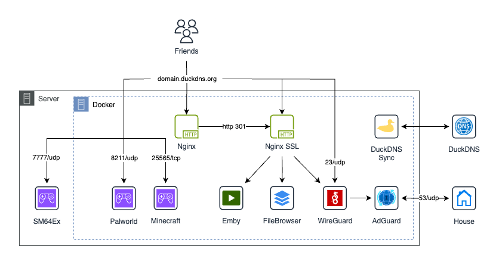

# Home Sever Instance

This repo contains a simple backup for my server's docker-compose. Fell free to use it if you wanna replicate all my configuration in your own linux instance, please note that you will need Docker for this process.

## Content of this repo

| Docker Services               | Systemd Services                  |
| ----------------------------- | --------------------------------- |
| AdGuard Home (adblock)        | SM64Ex Coop (games)               |
| Eady WireGuard (vpn)          |                                   |
| NGINX Instance (http)         |                                   |
| NGINX Instance SSL (https)    |                                   |
| Minecraft Server (games)      |                                   |
| Palworld Server (games)       |                                   |
| DuckDNS (ddns)                |                                   |
| Emby Media Server (streaming) |                                   |
| FileBrowser (filesharing)     |                                   |

### Overview

### Additional notes

1.  Default NGINX forwards into NGINX SSL using `http 301`. It also act as an endpoint for Let's Encrypt.
2.  Changes require adjustments inside `src/templates/main.nginx.conf` and `src/templates/gencerts.sh`.
3.  Some services require pre-configuration.
    - AdGuard: Disable `systemd-resolved` service from your host machine.
4.  Some services require post-configuration.
    - AdGuard: Create a new administrator and set webserver port to 3000 then restart.
    - WireGuard: Requires to configure AdGuard and restart.
    - Emby: Create a new user and mount your media library.
    - FileBrowser: Change administrator user. Default credentials are `admin:admin`.

## Install Docker Services

Fill and export some variables:

    vim src/env/variables.env
    export $(xargs < src/env/variables.env)
    
Run the install script. Please note this will install Docker and disable systemd-resolved.service

    bash install-dockers.sh             # install docker-compose.yaml
    bash /srv/scripts/gencerts.sh       # create ssl certificates

## Install Systemd Services

Run the install script. Please check script before running for pre-requirements.

    bash install-sm64ex-coop.sh

Once completed make sure to test and do post-configuration if needed!
